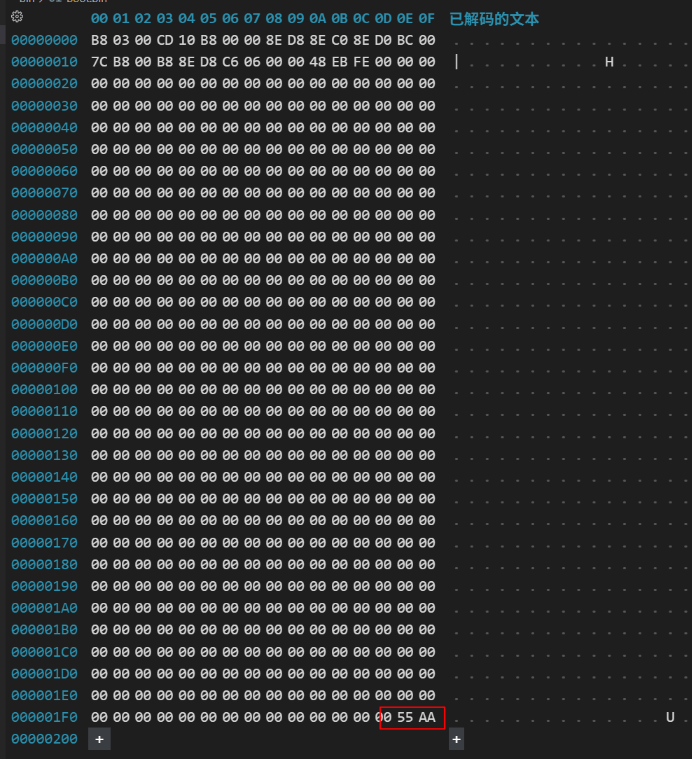

# 1. 项目搭建

## 1. 概述
这个项目的目标是实现一个最小功能的操作系统，设想应该要包含以下模块：

- 系统引导
- 内存管理
- 进程管理
- 设备管理
- 文件系统

挑战一个月能完成上面的内容。

## 2. 环境准备
1. vscode
2. Arch Linux
3. nasm
4. qemu

```console
sudo pacman -Sy nasm
sudo pacman -Sy qemu
sudo pacman -Sy qemu-arch-extra
```

## 3. 环境验证
### 3.1 生成boot.bin
一个简单的引导程序，让屏幕显示一个H
```asm
[org 0x7c00]

; 设置屏幕模式为文本模式，清楚屏幕
mov ax, 3
int 0x10

; 初始化段寄存器
mov ax, 0
mov ds, ax
mov es, ax
mov ss, ax
mov sp, 0x7c00

; 0xb8000是文本显示器的内存
mov ax, 0xb800
mov ds, ax
mov byte [0], 'H'

; 阻塞, $表示这一行
jmp $

; 填充剩下的区域为0
; times表示重复后面的指令
; $$ 表示开始的行
times 510 - ($ - $$) db 0


; bios要求，主引导扇区最后两个字节必须是0x55, 0xaa
db 0x55, 0xaa
```
编译这个汇编文件
```console
nasm -f bin src/boot/boot.asm -o bin/boot.bin
```
查看boot.bin，检查最后两个字节是否0x55AA



### 3.2 创建硬盘镜像
```console
# 创建一个 16M 的硬盘镜像
dd if=/dev/zero of=bin/master.img bs=512 count=32768 conv=notrunc

# 将 boot.bin 写入到主引导山区
dd if=bin/boot.bin of=bin/master.img bs=512 count=1 conv=notrunc
```
### 3.3 启动qemu进行模拟
```console
qemu-system-i386 -m 2048M -drive file=bin/master.img,if=ide,index=0,media=disk,format=raw
```
成功在qemu虚拟机的屏幕上打出一个'H'


## 4. 一些补充
1. x86 BIOS怎么识别到引导程序的？
   一般引导程序是放在硬盘的主引导扇区(第一个扇区)，大小为512 bytes，并且最后两个byte是0x55AA。
   BIOS检测到主引导扇区后，会把这个扇区的内容加载到内存0x7c00处，这也是为什么boot.asm的寻址要从0x7c00开始的原因。

2. nasm的基本语法和指令
   一些参考
   [https://www.cnblogs.com/alwaysking/p/8687441.html](https://www.cnblogs.com/alwaysking/p/8687441.html)
   [https://zhuanlan.zhihu.com/p/691679872](https://zhuanlan.zhihu.com/p/691679872)