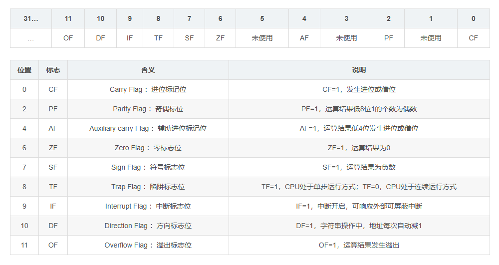
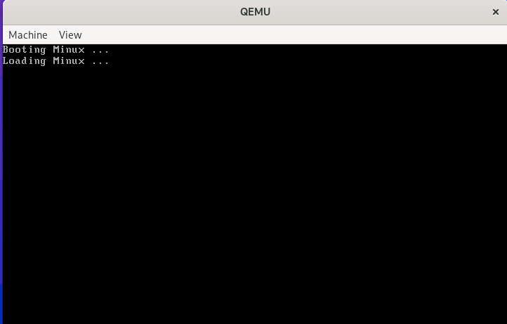

# 2. 主引导扇区
上一节我们写了一个简单的引导程序，把引导程序编译成bin档，写入了一个虚拟硬盘，成功被BIOS识别，最终在屏幕上打印出一个'H'。

那么这一节就来实现一个真正的引导程序。

## 1. 前置知识

### 1.1 主引导扇区的结构

主引导扇区一般长成这样：
- 446 bytes: 引导程序的代码
- 64 bytes: 硬盘分区表, 4 * 16，最多分为4个主分区
- 2 bytes: 魔数，0xaa55
  
其中硬盘分区表不是必须的，上一节做的主引导扇区就没有硬盘分区表。
主引导扇区的功能是读取内核加载器，并执行。

### 1.2 实模式
BIOS加载了引导程序后，我们就从BIOS的手中接过了控制权，主引导程序运行在实模式下，寄存器的位数是16 bit。
实模式下的段寄存器有：
- CS: 代码段寄存器
- DS: 数据段寄存器
- ES: 附加段寄存器
- FS: 附加段寄存器
- GS: 附加段寄存器
- SS: 栈段寄存器

实模式下的通用寄存器有：
- AX(AH, AL): 累加器，使用的频率最高
- BX(BH, BL): 基址寄存器，常用来存储内存地址，并以此作为基址，遍历一遍区域
- CX(CH, CL): 计数器，常用于循环计数
- DX(DH, DL): 数据寄存器，可用于存放数据，常用于存放外设控制器的端口号地址
- SI: 源变址寄存器，常用于字符串操作中，存放数据源地址
- DI: 目标变址寄存器，常用于字符串操作红，存放数据目的地址
- SP: 栈指针寄存器，存放栈的段偏移地址，于SS一起实现栈的操作
- BP: 基址指针，存放栈的段偏移地址，与SS一起配合，用于实现访问栈的任意位置的内容

实模式的标志寄存器，用于条件判断


实模式的寻址方式为：addr = 段寄存器 * 16 + 段内偏移
以打印H的代码为例
```asm
; 0xb8000是文本显示器的内存
mov ax, 0xb800
mov ds, ax
mov byte [0], 'H'
```
ds(数据段寄存器) = 0xb800, [0]表示直接寻寻址，即段内偏移为0，所以要写入H的地址就是： 0xb800 * 16 + 0 = 0xb8000。

参考：
[x86 CPU的实模式——寄存器（一）](https://blog.csdn.net/weixin_62515670/article/details/138589207?spm=1001.2101.3001.10752)
[x86 CPU的实模式——寻址（二）](https://blog.csdn.net/weixin_62515670/article/details/138620871?spm=1001.2101.3001.10796)

### 1.3 实模式打印
之前我们是直接往显存地址写入要显示的内容来打印东西，实模式下还可以通过bios中断来打印

- ah: 0x0e
- al: 显示的字符
- int 10

是一段打印的代码
```asm
; 把字符串的地址赋值给si寄存器
mov si, booting
call print

; 打印函数
print:
    mov ah, 0x0e
.next:
    ; 将si寄存器的值作为地址寻址
    mov al, [si]
    cmp al, 0
    jz .done
    int 0x10
    inc si
    jmp .next
.done:
    ret

; 定义字符串
booting:
    db "Booting Minux ...", 10, 13, 0 ; 10: \n, 13\r
```

## 2. 加载内核加载器

主引导程序要读取内核加载器，然后将控制权交给内核加载器。为什么主引导程序不能直接读取内核到内存中呢？其实也可以。但是主引导扇区中的代码区只有446 bytes，所以要主引导程序要写得很紧凑，大小才有可能控制在446 byte以内。更通用的做法是读取一个加载器到内存中，由加载器去设置环境，加载内核主体。

## 2.1 硬盘介绍
- 扇区：是硬盘读写的最小单位，最小一个，最多256个扇区
- 机械臂的训导时间是硬盘性能的主要瓶颈
- 一般情况下一个磁道有63个扇区，主要是由于BIOS最大支持这么多


## 2.2 硬盘读写
- CHS模式 Cylinder/Head/Sector 读写一个扇区需要3个坐标，比较繁琐
- LBA模式 Logical Block Address 把硬盘看成是一个逻辑块，只需要有sector no就能够读写

这里采用的是LBA模式读写硬盘, LBA28可以读取2^28^个扇区，也就是2^28^ * 512 = 128G的空间
| Primary 通道           | Secondary 通道 | in 操作      | out 操作     |
|------------------------|----------------|--------------|--------------|
| 0x1F0                   | 0x170          | Data         | Data         |
| 0x1F1                   | 0x171          | Error        | Features     |
| 0x1F2                   | 0x172          | Sector count | Sector count |
| 0x1F3                   | 0x173          | LBA low      | LBA low      |
| 0x1F4                   | 0x174          | LBA mid      | LBA mid      |
| 0x1F5                   | 0x175          | LBA high     | LBA high     |
| 0x1F6                   | 0x176          | Device       | Device       |
| 0x1F7                   | 0x177          | Status       | Command      |

- 0x1F0：16bit 端口，用于读写数据
- 0x1F1：检测前一个指令的错误
- 0x1F2：读写扇区的数量
- 0x1F3：起始扇区的 0 ~ 7 位
- 0x1F4：起始扇区的 8 ~ 15 位
- 0x1F5：起始扇区的 16 ~ 23 位
- 0x1F6:
    - 0 ~ 3：起始扇区的 24 ~ 27 位
    - 4: 0 主盘, 1 从片
    - 6: 0 CHS, 1 LBA
    - 5 ~ 7：固定为1
- 0x1F7: out
    - 0xEC: 识别硬盘
    - 0x20: 读硬盘
    - 0x30: 写硬盘
- 0x1F7: in / 8bit
    - 0 ERR
    - 3 DRQ 数据准备完毕
    - 7 BSY 硬盘繁忙

### 2.2.1 读取硬盘数据
汇编也是可以面向过程编程的，读取硬盘的程序可以设计成这样
```asm
; 定义参数
; 目标内存
mov edi, 0x1000
; 起始扇区
mov ecx, 0x0
; 读取扇区个数
mov bl 1

; 读取函数
read_disk:
    ; 根据前面的表格设置硬盘模式
    ; 设置读取扇区的个数
    mov dx, 0x1F2
    mov ax, bx
    out dx, ax

    ; 设置起始扇区
    inc dx                  ;  0x1F3
    mov al, cl              ;  0~7位
    out dx, al

    inc dx                  ;  0x1F4
    shr ecx, 8              ;  ecx的值右移8位
    mov al, cl              ;  8~15位
    out dx, al
    .....

    ; 设置完成后就开始读取
    xor ecx, ecx            ; 将ecx清空
    mov ecx, bl             ; 得到扇区个数的数量

    ; 读写扇区
    .read:
        push cx             ; 先保存一下cx, 因为在reads中有循环会修改cx
        ; 等待数据准备完毕
        call .waits
        ; 读取一个扇区
        call .reads
        pop cx              ; 恢复cx
        loop .read          ; loop指令相当于 while(ecx != 0) 每次执行会将ecx--
ret
```
等待数据准备完毕
```asm
    ; 等待硬盘准备好
    .waits:
        mov dx, 0x1f7
        .check:
            ; 读取状态到al寄存器
            in al, dx
            ; 需要一点点延迟
            jmp $+2         ; nop 直接跳转到下一行
            jmp $+2
            jmp $+2
            ; 关注第3位和第7位
            and al, 0b1000_1000
            ; 看第3位是否位1，第7位是否为0
            cmp al, 0b0000_1000
            ; 如果不相等, 继续check
            jnz .check
    ret
```
读取一个扇数据
```asm
; 读取一个扇区
    .reads:
        mov cx, 256            ; 一个扇区256个字
        mov dx, 0x1f0
        ; 读取一个字
        .readw:
            in ax, dx
            ; 需要一点点延迟
            jmp $+2         ; nop 直接跳转到下一行
            jmp $+2
            jmp $+2
            mov [edi], ax
            loop .readw

    ret
```
所以读取硬盘数据函数的总体结构就是
```sh
read_disk:
- 1. 设置硬盘模式
- read
    - waits
    - reads

```
如果用C/C++写的话，肯定很简单，一个函数调用几个子函数。用汇编也是同样的道理，就是参数的传递都是直接通过寄存器。


## 3. 执行内核加载器
前面我们将硬盘中的某些扇区加载到内存中，这些扇区是内核加载器的代码和数据，目前还没有什么内容。接下来就是写一个简单的内核加载器。

### 3.1 简单的内核加载器
一个很简单的loader，我们先只打印一些信息
```asm
[org 0x1000]

dw 0x55aa   ; 魔数判断

mov si, loading
call print

jmp $

; 打印函数
print:
    mov ah, 0x0e
.next:
    mov al, [si]
    cmp al, 0
    jz .done
    int 0x10
    inc si
    jmp .next
.done:
    ret

loading:
    db "Loading Minux ...", 10, 13, 0 ; 10: \n, 13\r
```
然后编译成loader.bin
```sh
# loader.bin
 $(BUILD_DIR)/loader.bin: $(SRC_DIR)/boot/loader.asm
	$(shell mkdir -p $(dir $@))
	nasm -f bin $< -o $@

# 写入到硬盘中
# $@ 表示目标文件 $< 表示依赖文件
$(IMAGE_DIR)/master.img: $(BUILD_DIR)/boot.bin $(BUILD_DIR)/loader.bin
	$(shell mkdir -p $(dir $@))
	dd if=/dev/zero of=$@ bs=512 count=32768 conv=notrunc # 创建一个 16M 的硬盘镜像
	dd if=$(BUILD_DIR)/boot.bin of=$@ bs=512 count=1 conv=notrunc # 将 boot.bin 写入到主引导扇区
	dd if=$(BUILD_DIR)/loader.bin of=$@ bs=512 count=4 seek=2 conv=notrunc # 将 loader.bin 写入到主引导扇区，起始扇区为2，大小为4

```
### 3.2 主引导扇区读入
设置对应的读取硬盘数据的参数
```asm
; 目标内存
mov edi, 0x1000
; 起始扇区
mov ecx, 0x2
; 读取扇区个数
mov bl, 0x4
call read_disk

```
### 3.3 跳转内核加载器执行
比较魔数，如果对上，就跳转到loader执行(jmp 0:0x1002)
```asm
cmp word [0x1000], 0x55aa
jnz error

; 跳转到loader执行
jmp 0:0x1002
```


## 4. 总结
本节实现了
1. 读取硬盘数据
2. 一个简单的主引导程序，读取loader到内存中并执行它

目前这个loader只是打印了字符串，下一节将介绍loader到底要干什么。