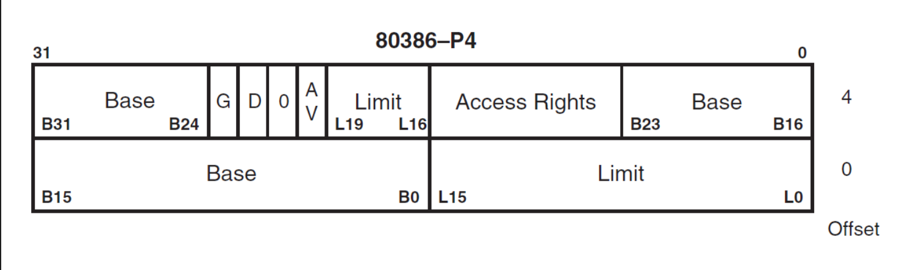

# 3.内核加载器
这节来写一个内核加载器，主要是做以下几件事
```sh
1. 检测机器的内存分布
2. 准备全局描述符表
3. 加载全局描述符表，进入保护模式
4. 加载内核到内存中
5. 跳转到内核入口函数执行
```

## 1. 实模式内存分布
实模式只能访问1M以内的内存，内存分布如下
| 起始地址  | 结束地址  | 大小     | 用途               |
| --------- | --------- | -------- | ------------------ |
| `0x000`   | `0x3FF`   | 1KB      | 中断向量表         |
| `0x400`   | `0x4FF`   | 256B     | BIOS 数据区        |
| `0x500`   | `0x7BFF`  | 29.75 KB | 可用区域           |
| `0x7C00`  | `0x7DFF`  | 512B     | MBR 加载区域       |
| `0x7E00`  | `0x9FBFF` | 607.6KB  | 可用区域           |
| `0x9FC00` | `0x9FFFF` | 1KB      | 扩展 BIOS 数据区   |
| `0xA0000` | `0xAFFFF` | 64KB     | 用于彩色显示适配器 |
| `0xB0000` | `0xB7FFF` | 32KB     | 用于黑白显示适配器 |
| `0xB8000` | `0xBFFFF` | 32KB     | 用于文本显示适配器 |
| `0xC0000` | `0xC7FFF` | 32KB     | 显示适配器 BIOS    |
| `0xC8000` | `0xEFFFF` | 160KB    | 映射内存           |
| `0xF0000` | `0xFFFEF` | 64KB-16B | 系统 BIOS          |
| `0xFFFF0` | `0xFFFFF` | 16B      | 系统 BIOS 入口地址 |

所以我们可以把内核加载器加载到0x1000的位置
```asm
[org 0x1000]
```

## 2. 内存检测
内核加载器需要检测可用内存，通过BIOS的15号中断的子功能0xe820可以知道当前机器的内存分布。

Address Range Descriptor Structure ARDS

| 字节偏移量 | 属性名称     | 描述                             |
| ---------- | ------------ | -------------------------------- |
| 0          | BaseAddrLow  | 基地址的低 32 位                 |
| 4          | BaseAddrHigh | 基地址的高 32 位                 |
| 8          | LengthLow    | 内存长度的低 32 位，以字节为单位 |
| 12         | LengthHigh   | 内存长度的高 32 位，以字节为单位 |
| 16         | Type         | 本段内存的类型                   |

Type 字段

| Type 值 | 名称                 | 描述                                                                                 |
| ------- | -------------------- | ------------------------------------------------------------------------------------ |
| 1       | AddressRangeMemory   | 这段内存可以被操作系统使用                                                           |
| 2       | AddressRangeReserved | 内存使用中或者被系统保留，操作系统不可以用此内存                                     |
| 3       |                      | 存储ACPI表，可以被操作系统回收。|
| 4       |                      | 操作系统不可使用这段内存。|
| 5       |                      | 已经损坏的内存区域，不可使用。|
| 其他    | 未定义               | 未定义，将来会用到．目前保留． 但是需要操作系统一样将其视为ARR(AddressRangeReserved) |

调用前输入

| 寄存器或状态位 | 参数用途                                                                                                                                                                                                                                                                                                 |
| -------------- | -------------------------------------------------------------------------------------------------------------------------------------------------------------------------------------------------------------------------------------------------------------------------------------------------------- |
| EAX            | 子功能号： EAX 寄存器用来指定子功能号，此处输入为 0xE820                                                                                                                                                                                                                                                 |
| EBX            | 内存信息需要按类型分多次返回，由于每次执行一次中断都只返回一种类型内存的ARDS 结构，所以要记录下一个待返回的内存ARDS，在下一次中断调用时通过此值告诉 BIOS 该返回哪个 ARDS，这就是后续值的作用。第一次调用时一定要置为0，EBX 具体值我们不用关注，字取决于具体 BIOS 的实现，每次中断返回后，BIOS 会更新此值 |
| ES: DI         | ARDS 缓冲区：BIOS 将获取到的内存信息写入此寄存器指向的内存，每次都以 ARDS 格式返回                                                                                                                                                                                                                       |
| ECX            | ARDS 结构的字节大小：用来指示 BIOS 写入的字节数。调用者和 BIOS 都同时支持的大小是 20 字节，将来也许会扩展此结构                                                                                                                                                                                          |
| EDX            | 固定为签名标记 `0x534d4150`，此十六进制数字是字符串 `SMAP` 的ASCII 码： BIOS 将调用者正在请求的内存信息写入 ES: DI 寄存器所指向的ARDS 缓冲区后，再用此签名校验其中的信息                                                                                                                                 |

准备工作
```asm
    .prepare:
        ; 清零EBX
        xor ebx, ebx
        ; 设置缓冲区
        mov ax, 0
        mov es, ax
        mov edi, ards_buffer

        ; 设置edx为固定签名
        mov edx, 0x534d4150
```
返回值

| 寄存器或状态位 | 参数用途                                                                                                                                                                                                                                   |
| -------------- | ------------------------------------------------------------------------------------------------------------------------------------------------------------------------------------------------------------------------------------------ |
| CF 位          | 若CF 位为 0 表示调用未出错，CF 为1，表示调用出错                                                                                                                                                                                           |
| EAX            | 字符串 SMAP 的 ASCII 码 `0x534d4150`                                                                                                                                                                                                       |
| ES:DI          | ARDS 缓冲区地址，同输入值是一样的，返回时此结构中己经被BIOS 填充了内存信息                                                                                                                                                                 |
| ECX            | BIOS 写入到 ES:DI 所指向的 ARDS 结构中的字节数，BIOS 最小写入 20 字节                                                                                                                                                                      |
| EBX            | 后续值：下一个 ARDS 的位置。每次中断返回后，BIOS 会更新此值， BIOS 通过此值可以找到下一个待返回的 ARDS 结构，咱们不需要改变 EBX 的值，下一次中断调用时还会用到它。在 CF 位为 0 的情况下，若返回后的 EBX 值为 0，表示这是最后一个 ARDS 结构 |

循环调用中断来检测内存
```asm
    .detect:
        ; 设置eax为0xe820，子功能号
        mov eax, 0xe820
        ; 设置ards结构体的字节大小为20 bytes
        mov ecx, 20
        ; 调用BIOS中断
        int 0x15

        ; 检测标志寄存器CF位置，如果置位，说明出错
        jc error
        ; 没有问题，将buffer指针指向下一个ards地址
        add edi, ecx
        ; 判断ebx是否为0，为0表示结束
        cmp ebx, 0
        jnz .detect

        ; 检测结束
        mov si, msg_detect_memory
        call print

; e820 数组个数
ards_count:
    dw 0

; e820 数组
ards_buffer:
```

## 2. 保护模式
目前系统是运行在实模式下，这种模式下所有程序(包括病毒)都可以访问1M内的任意内存，是不安全的。
后来引入了保护模式，在保护模式下：
- 某些寄存器只能内核访问
- 用内存全局描述符规定内存的访问权限，保护内存
- 只能由内核进行端口的in/out操作

### 2.1 全局描述符
用于描述内存的访问权限



```cpp
typedef struct descriptor /* 共 8 个字节 */
{
    unsigned short limit_low;      // 段界限 0 ~ 15 位
    unsigned int base_low : 24;    // 基地址 0 ~ 23 位 16M
    unsigned char type : 4;        // 段类型
    unsigned char segment : 1;     // 1 表示代码段或数据段，0 表示系统段
    unsigned char DPL : 2;         // Descriptor Privilege Level 描述符特权等级 0 ~ 3
    unsigned char present : 1;     // 存在位，1 在内存中，0 在磁盘上
    unsigned char limit_high : 4;  // 段界限 16 ~ 19;
    unsigned char available : 1;   // 该安排的都安排了，送给操作系统吧
    unsigned char long_mode : 1;   // 64 位扩展标志
    unsigned char big : 1;         // 32 位 还是 16 位;
    unsigned char granularity : 1; // 粒度 4KB 或 1B
    unsigned char base_high;       // 基地址 24 ~ 31 位
} __attribute__((packed)) descriptor;
```
主要包含3个属性：
- 内存的起始地址
- 这段内存的长度 / 界限 = 长度 - 1
- 内存属性

type segment = 1

| X | C/E | R/W | A |

- A: Accessed 是否被 CPU 访问过
- X: 1/代码 0/数据
- X = 1：代码段
    - C: 是否是依从代码段
    - R: 是否可读
- X = 0: 数据段
    - E: 0 向上扩展 / 1 向下扩展
    - W: 是否可写

### 2.2 全局描述符表
全局描述符表 GDT Global Descriptor Table
```c
descriptor gdt[8192]
```
- 最多8192个
- gdt[0] 的内容必须全为0

cpu提供一个寄存器gdtr，来存放全局描述符表的信息，这个寄存器要指向一个地址，该地址的内容为
```c
typedef struct pointer
{
    unsigned short limit; // size - 1
    unsigned int base;
} __attribute__((packed)) pointer;
```
可以通过指令加载和保存gdtr
```asm
lgdt [gdt_ptr];  加载gdtr
sgdt [gdt_ptr];  保存gdtr
```

```asm
; 内存段基地址
memory_base equ 0
; 内存段界限，粒度是4K，所以是 4G / 4K  - 1
memory_limit ((1024 * 1024 * 1024 * 4) / (1024 * 4) - 1)

; 全局描述符指针
gdt_ptr:
    dw (gdt_end - gdt_base) - 1
    dd gdt_base

; 全局描述符表
; 第一个全局描述符必须是0
gdt_base:
    dd 0, 0
; 代码段全局描述符
gdt_code:
    dw memory_limit & 0xffff        ; 段界限bit 0~15
    dw memory_base & 0xffff         ; 内存段基址bit 0~15
    db (memory_base >> 16) & 0xff   ; 内存段基址bit 16~23
    ; 存在 - dpl 0 - S - 代码段 - 非已从 - 可读 - 没有被访问过
    db 0b_1_00_1_1_0_1_0
    ; 4K粒度 - 32位 - 不是64位 - 段界限 bit 16~19
    db 0b1_1_0_0_0000 | (memory_limit >> 16) & 0xf
    db (memory_base >> 24) & 0xff   ; 内存段及地址 bit 24~31

; 代码段全局描述符
gdt_data:
    dw memory_limit & 0xffff        ; 段界限bit 0~15
    dw memory_base & 0xffff         ; 内存段基址bit 0~15
    db (memory_base >> 16) & 0xff   ; 内存段基址bit 16~23
    ; 存在 - dpl 0 - S - 数据段 - 向上 - 可写 - 没有被访问过
    db 0b_1_00_1_0_0_1_0
    ; 4K粒度 - 32位 - 不是64位 - 段界限 bit 16~19
    db 0b1_1_0_0_0000 | (memory_limit >> 16) & 0xf
    db (memory_base >> 24) & 0xff   ; 内存段及地址 bit 24~31
gdt_end:
```

### 2.3 段选择子
- 只需要一个代码段
- 需要一个或多个数据段
- 加载到段寄存器中
实模式的寻址方式是 段寄存器 << 4 + 段内偏移，在保护模式段寄存器存放的就是段选择子
```cpp
typedef struct selector
{
    unsigned char RPL : 2; // Request PL 
    unsigned char TI : 1; // 0  全局描述符 1 局部描述符 LDT Local 
    unsigned short index : 13; // 全局描述符表索引
} __attribute__((packed)) selector;
```
```asm
code_selector equ (1 << 3)
data_selector equ (2 << 3)
```

### 2.4 A20地址线
- 8086 16根地址线，寻址方式为段寄存器 << 4 + offset, 有可能大于1M内存。比如2^16^ << 4 + 0xFFFF = 0x10FFFF。这种情况下就会用1M来做模运算。

- 80286 24根地址线，可以访问16M内存，如果不打开A20地址线，就无法访问那么大的内存
- 80286 32根地址线，可以访问4G内存，如果不打开A20地址线，就无法访问那么大的内存

打开A20地址线，0x92端口bit 1置为1即可
```asm
    ; 打开A20地址线
    in al, 0x92
    or al, 0b10
    out 0x92, al
```

### 2.5 进入保护模式
有了前面的准备，就可以进入保护模式了，进入方法就是是cr0寄存器bit 0置为1.
```asm
    cli                 ; 关中断，很重要，不然可能会有奇奇怪怪的错误
    lgdt [gdt_ptr] ; 加载gdt指针
    ; 将cr0寄存器bit 0 置1，启动保护模式
    mov eax, cr0
    or eax, 1
    mov cr0, eax
    ; 跳转刷新缓存
    jmp dword code_selector:protected_mode

[bits 32]
protected_mode:
    ; 初始化段寄存器
    mov ax, data_selector
    mov ds, ax
    mov es, ax
    mov fs, ax
    mov gs, ax
    mov ss, ax

    ; 设置栈顶指针
    mov esp, 0x10000
```

